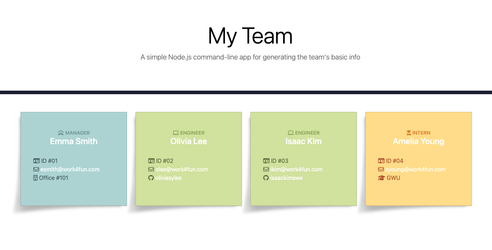

  # Team Profile Generator

  ## Description
  This application is a Node.js command-line application that enables users to generate simple team profile HTML files by answering prompts in the command-line. It takes in information about the employees on a software engineering team and uses that information to generate an HTML webpage that displays the input data. The goal of the application is to provide a quick and easy way to create a visually appealing team profile webpages that display important information about the team members.
  
  ## Table of Contents
  - [Description](#description)
  - [Installation](#installation)
  - [Usage](#usage)
  - [License](#license)
  - [Contributing](#contributing)
  - [Tests](#tests)
  - [Questions](#questions)
  
  ## Installation
  1. Clone this repository. 
  ```
  git clone git@github.com:oliviasylee/team-profile-generator.git 
  ```
  2. Run ‘npm install’ from the terminal at the root directory of the local repository to install the required dependencies.
  ```
  npm install
  ```
  3. Run ‘Node index.js’ to run the application.
  ```
  node index.js
  ```
  ## Usage
Here is a full movie showing how the application works. Click the below screenshot. <br>
[](https://drive.google.com/file/d/1HA8Yzy8ePvq8e9AbrcB4wwuA5Z-RK-GQ/view)
 ### Application Interface
[](https://github.com/oliviasylee/team-profile-generator)

  ## Tests
  This application has been developed using the Test-Driven Development (TDD) approach with the help of "Jest" package. To ensure that the properties and methods of each of the classes are working as expected, you can run the following command to run the tests.

```
  npm test
```
  ## Contributing
  Olivia Seonyeong Lee
  
  ## Questions
  If you have any questions about this projects, please contact me at oliviasylee@gmail.com. You can view more of my projects at https://github.com/oliviasylee.